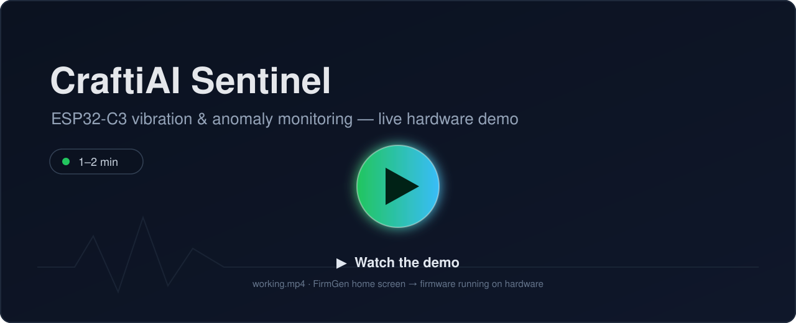
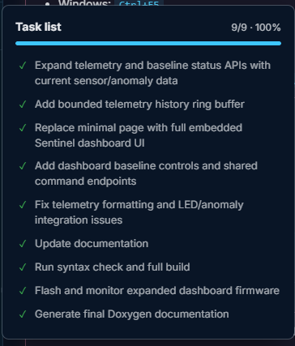
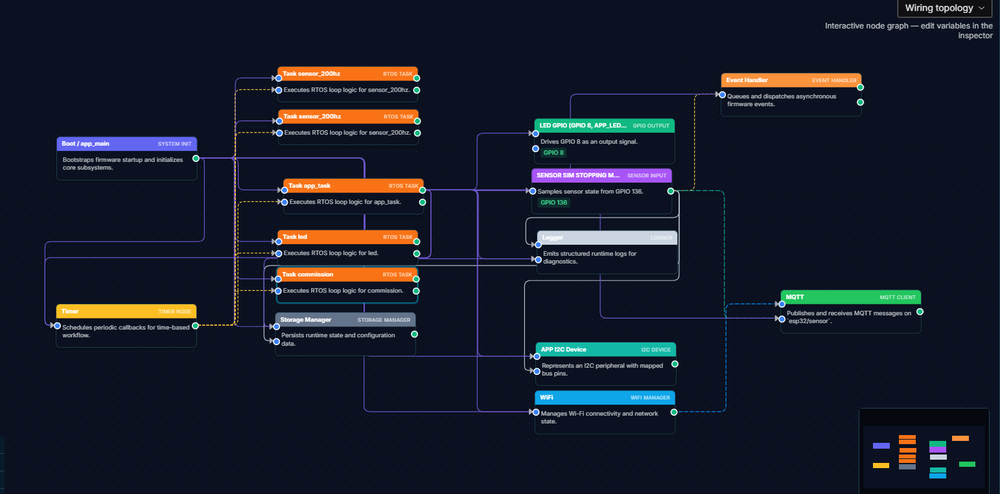

# CraftiAI Sentinel

> AI-generated, production-oriented condition-monitoring firmware for the **ESP32-C3** — real-time vibration and temperature sensing, on-device machine-state classification, self-learned anomaly baselines, a phone-friendly Wi-Fi dashboard, and a single-LED status beacon.


CraftiAI Sentinel is a hackathon project built end-to-end with **FirmGen**, an AI firmware-generation tool. FirmGen produced the plan, the wiring topology, and the source tree; the result was iterated and flashed onto real hardware where it detects a machine's operating phase and flags abnormal vibration.

---

## Demo video

[](working.mp4)

**▶ [Click to play `working.mp4`](working.mp4)** (1–2 min). The clip opens on the **FirmGen home screen**, then focuses on the firmware running on the physical ESP32-C3 + HW-290 rig: the live dashboard updating over Wi-Fi, the machine-phase transitions, and the onboard LED changing color with machine state.

> GitHub does not embed repository-hosted `.mp4` files inline, so the thumbnail above links to the video file. Click it (or open `working.mp4`) to watch. To get an auto-playing inline preview, drag-and-drop the same file into this README on github.com and GitHub will host and embed it.

---

## Table of contents

1. [Problem definition](#1-problem-definition)
2. [Target users](#2-target-users)
3. [Built with FirmGen — plan & iteration history](#3-built-with-firmgen--plan--iteration-history)
4. [Features](#4-features)
5. [System overview](#5-system-overview)
6. [Hardware, wiring & bill of materials](#6-hardware-wiring--bill-of-materials)
7. [I²C device detection](#7-i2c-device-detection)
8. [Vibration acquisition & filtering](#8-vibration-acquisition--filtering)
9. [Operating states](#9-operating-states)
10. [Baseline commissioning & anomaly detection](#10-baseline-commissioning--anomaly-detection)
11. [Device-hosted dashboard](#11-device-hosted-dashboard)
12. [WS2812 LED status](#12-ws2812-led-status)
13. [Build & flash](#13-build--flash)
14. [Configuration reference](#14-configuration-reference)
15. [Source layout](#15-source-layout)
16. [Limitations & next work](#16-limitations--next-work)
17. [FirmGen chat export](#17-firmgen-chat-export)
18. [Generated API documentation](#18-generated-api-documentation)

---

## 1. Problem definition

Small workshops, makerspaces, and light-industrial operators run motors, pumps, compressors, and CNC spindles that fail expensively and without warning. Commercial predictive-maintenance systems exist, but they are costly, cloud-locked, and overkill for a single machine.

The core problems Sentinel targets:

- **No early warning.** Bearing wear, imbalance, and looseness show up as rising vibration long before a machine fails, but nobody is watching the signal.
- **Every machine is different.** A "normal" vibration level for one machine is a fault on another, so fixed thresholds don't transfer.
- **Setup must be trivial.** Operators are not vibration analysts; commissioning has to be a button press, not a spreadsheet.
- **Connectivity can't be assumed.** The device must be useful with no internet, no app install, and no account.

CraftiAI Sentinel is a **self-contained, self-calibrating vibration sentry** on a sub-$10 microcontroller. It learns each machine's normal behavior on-site, then watches for deviations and signals them locally (LED) and over a device-hosted web page — no cloud required.

## 2. Target users

- **Small manufacturers & workshops** monitoring a critical motor, pump, or compressor without a SCADA budget.
- **Makerspaces & educational labs** teaching condition monitoring and embedded ML/DSP on affordable hardware.
- **Maintenance technicians** who want a cheap, mountable "check engine light" for rotating equipment.
- **Embedded / firmware developers** evaluating an AI-generated, cleanly layered ESP-IDF codebase as a reference design.

## 3. Built with FirmGen — plan & iteration history

This firmware was generated and iterated with **FirmGen**. FirmGen produced a task plan, a hardware/software wiring topology, and the layered source tree, then drove the build/flash/verify loop to convergence.

### FirmGen task list (generated plan + iteration history)

The generated plan was executed and iterated to completion — all nine milestones closed, including API expansion, the telemetry ring buffer, the full embedded dashboard UI, LED/anomaly integration fixes, documentation, build/flash verification, and Doxygen generation.



### FirmGen wiring topology (generated architecture)

FirmGen's node graph maps the runtime: the `app_main` boot node fans out into RTOS tasks (`sensor_200hz`, `app_task`, `led`, `commission`), which drive the LED GPIO output, read the I²C sensor input, persist state via the storage manager, and connect Wi-Fi — with logging, event handling, and an MQTT client stubbed for future telemetry.



## 4. Features

- **Real-time vibration sensing** from an MPU-6050 accelerometer, sampled at a 200 Hz target with gravity removal and EMA smoothing.
- **On-device machine-state classification** — `OFF → STARTING → RUNNING → STOPPING`, plus a `FAULT` state, with transient handling so startup/shutdown are not mistaken for faults.
- **Self-learned baselines** — the device records per-phase vibration statistics over 10 real machine cycles and derives machine-specific `warning`/`critical` thresholds, persisted to NVS.
- **Anomaly detection with hysteresis** — warning/critical levels use persistence and recovery timers to avoid flapping.
- **Device-hosted dashboard** — an ESP32-C3 SoftAP + native HTTP server serving a self-contained live web UI and a JSON API; no app, no cloud, no internet.
- **Single-LED status beacon** — the onboard WS2812 encodes machine and anomaly state by color, with pulsing for alerts.
- **Temperature monitoring** from the BMP180.
- **Serial + web commissioning commands** with a shared command path.
- **Clean, layered, documented source** with generated Doxygen API docs.

## 5. System overview

Sentinel monitors an **HW-290 / GY-91** sensor board over I²C:

- **MPU-6050** — accelerometer and vibration source
- **BMP180** — temperature and pressure sensor; this project currently uses temperature
- **WS2812 RGB LED** — local operating/anomaly indicator (onboard the DevKitM-1)
- **ESP32-C3 SoftAP + HTTP server** — device-hosted commissioning webpage

Humidity is not available from the BMP180. Add a separate humidity sensor in a future hardware revision if humidity monitoring is required.

```text
        ┌──────────────┐      I²C @400kHz      ┌───────────────────────┐
        │  HW-290 /    │  SDA=GPIO4 SCL=GPIO5  │      ESP32-C3         │
        │  GY-91 board │ ───────────────────►  │   DevKitM-1          │
        │  MPU-6050    │                       │                       │
        │  BMP180      │                       │  sensor_200hz task    │
        └──────────────┘                       │  operating_state      │
                                               │  baseline_learner     │
                                               │  anomaly_detector      │
                                               │  telemetry ring       │
        ┌──────────────┐   GPIO8 (WS2812)      │  dashboard (SoftAP)   │
        │ Onboard LED  │ ◄───────────────────  │                       │
        └──────────────┘                       └───────────┬───────────┘
                                                           │ Wi-Fi AP
                                            SSID: Sentinel-Setup
                                            http://192.168.4.1/
                                                           ▼
                                              📱 phone / laptop browser
```

## 6. Hardware, wiring & bill of materials

Target board: **ESP32-C3-DevKitM-1**.

### Bill of materials (BOM)

| # | Component | Qty | Notes |
|---|---|---:|---|
| 1 | ESP32-C3-DevKitM-1 | 1 | RISC-V SoC, USB-JTAG/serial, **onboard WS2812** on GPIO8 |
| 2 | HW-290 / GY-91 IMU + baro module | 1 | Provides **MPU-6050** accel (`0x68`) and **BMP180** temp/pressure (`0x76/0x77`); onboard pull-ups |
| 3 | Female–female jumper wires | 4 | 3V3, GND, SDA (GPIO4), SCL (GPIO5) |
| 4 | USB-C cable | 1 | Power, flashing, and 115200-baud serial console |
| 5 | Mechanical mount (bracket / adhesive / zip-tie) | 1 | **Rigid** coupling to the monitored machine — mounting stiffness affects readings |
| 6 | *(optional)* 3.3 V field supply (Li-ion + regulator) | — | For deployment without a host USB port |

No separate LED, resistors, or breadboard are required — the status LED is on the DevKitM-1.

### Pinout

| Function | GPIO | Direction / notes |
|---|---:|---|
| HW-290 SDA | **4** | I²C data; module has onboard pull-ups |
| HW-290 SCL | **5** | I²C clock; module has onboard pull-ups |
| Onboard WS2812 data | **8** | Addressable RGB LED; reserved |
| BOOT button | **9** | Board button, active-low; not used by Sentinel sensor firmware |
| USB-JTAG D− | **18** | USB interface; do not assign peripherals |
| USB-JTAG D+ | **19** | USB interface; do not assign peripherals |
| UART RX | **20** | Serial console input |
| UART TX | **21** | Serial console output |
| Restricted GPIOs | **11–17** | Connected to integrated flash; do not use |

### HW-290 wiring

```text
ESP32-C3-DevKitM-1       HW-290 / GY-91
------------------       --------------
3V3                      VCC
GND                      GND
GPIO4                    SDA
GPIO5                    SCL
```

Use **3.3 V logic**. Do not connect the sensor board to 5 V logic unless the module's level compatibility has been independently verified.

## 7. I2C device detection

At startup, Sentinel scans the 7-bit I²C address space and reports every responding address.

Expected addresses for the tested board:

| Device | Address | Identification register | Expected value |
|---|---:|---:|---:|
| MPU-6050 | `0x68` or `0x69` | `WHO_AM_I`, `0x75` | `0x68` |
| BMP180 | `0x76` or `0x77` | Chip ID, `0xD0` | `0x55` |

The firmware does not silently configure unknown chip IDs as known devices.

## 8. Vibration acquisition & filtering

The MPU-6050 is configured for:

- Full-scale accelerometer range: **±2 g**
- Raw acquisition target: **200 Hz**
- Sample interval: **5 ms**
- MPU digital low-pass filter: `APP_MPU_DLPF_CFG=2`, approximately 94 Hz bandwidth
- Sample-rate divider: `APP_MPU_SAMPLE_RATE_DIV=4`
- Telemetry aggregation window: **100 ms**
- Serial/dashboard summary rate: approximately **10 Hz**

Static gravity is estimated independently on X, Y, and Z and removed before calculating dynamic vibration magnitude. The magnitude is smoothed with an exponential moving average:

```text
filtered = alpha * new_value + (1 - alpha) * filtered
```

Default:

```c
#define APP_SENSOR_EMA_ALPHA 0.25f
```

Each summary reports vibration RMS, peak, sample count, I²C/read errors, temperature, operating phase, and anomaly state.

## 9. Operating states

Sentinel classifies machine behavior as:

```text
OFF → STARTING → RUNNING → STOPPING → OFF
```

A `FAULT` state is used for persistent abnormal behavior. Startup and shutdown transients are handled separately so they are not immediately treated as running-condition faults.

Current commissioning defaults:

| Setting | Default |
|---|---:|
| Start threshold | `0.08 g RMS` |
| Stop threshold | `0.05 g RMS` |
| Fault threshold | `0.30 g RMS` |
| Recovery threshold | `0.20 g RMS` |
| Startup settling | `10 s` |
| Stop confirmation | `2 s` |
| Fault persistence | `2 s` |
| Fault clear persistence | `5 s` |

These are provisional values. Real machine thresholds must be established through baseline commissioning.

## 10. Baseline commissioning & anomaly detection

Simulation is disabled in the production configuration:

```c
#define APP_SENSOR_SIMULATION 0
```

A valid baseline requires **10 complete real-machine cycles** in this order:

```text
OFF → STARTING → RUNNING → STOPPING → OFF
```

The baseline learner records per-phase vibration statistics and derives running thresholds:

```text
warning  = max(0.08 g, mean + 3 × standard deviation)
critical = max(0.30 g, mean + 5 × standard deviation)
```

A valid baseline is saved to NVS only after completion. An incomplete or invalid trial must not replace an existing valid baseline. The anomaly detector then applies persistence (an elevated reading must hold ~2 s before it is declared) and recovery hysteresis (levels clear only after the signal stays below 80 % of the warning threshold for ~5 s), preventing alert flapping.

### Commissioning commands

Commands are line-based and terminated with Enter. They are available through the serial console **and** the device-hosted dashboard command path:

```text
START_BASELINE
STOP_BASELINE
RESET_BASELINE
BASELINE_STATUS
HELP
```

Recommended procedure:

1. Install Sentinel securely on the machine.
2. Power the machine off and allow vibration to settle.
3. Connect to the Sentinel dashboard or serial console.
4. Issue `START_BASELINE`.
5. Operate the machine normally through at least 10 complete cycles.
6. Issue `BASELINE_STATUS` to check progress.
7. Stop only after the required cycles are complete.
8. Confirm the baseline is valid before enabling production alerts.

Do not collect a baseline while the machine has a known fault or abnormal load.

## 11. Device-hosted dashboard

Sentinel creates a local WPA2 Wi-Fi access point and serves a self-contained page:

```text
SSID:      Sentinel-Setup
Password:  Sentinel1234
Address:   http://192.168.4.1/
```

<p align="center">
  
</p>

The live web UI (shown above running on a phone) displays machine phase, vibration RMS and peak, temperature, anomaly status, and baseline validity/progress, with **Start baseline** and **Stop** controls.

Usage:

1. Connect a phone or computer to `Sentinel-Setup`.
2. Temporarily disable mobile data, VPN, or another active network if the browser chooses the wrong route.
3. Open `http://192.168.4.1/` manually.
4. Hard-refresh the page if an older cached page appears.

The webpage provides two controls — **Start baseline** and **Stop** — and displays formatted live values for machine phase, vibration RMS, vibration peak, temperature, anomaly status, baseline validity and progress, and connection/update status.

Machine-readable endpoints:

```text
GET  http://192.168.4.1/api/status     → current telemetry snapshot (JSON)
GET  http://192.168.4.1/api/history    → recent telemetry ring buffer (JSON)
POST http://192.168.4.1/api/command    → commissioning command (text body)
```

The dashboard is implemented with the native ESP-IDF HTTP server. FastAPI/Python is not run on the ESP32-C3.

## 12. WS2812 LED status

The onboard addressable LED is on GPIO8. Status priority is:

| LED indication | Meaning |
|---|---|
| Off | Machine OFF |
| Blue | STARTING or STOPPING |
| Green | Normal RUNNING |
| Yellow | Baseline learning |
| Amber | Warning anomaly |
| Red | Critical anomaly or fault |
| Purple | Sensor-health fault |

Warning, critical, and sensor-fault indications may pulse (critical pulses fastest).

## 13. Build & flash

Clone the repository and open the project directory (the folder that contains this README and `CMakeLists.txt`).

Prerequisites: **ESP-IDF v5.x** installed and exported (`. $IDF_PATH/export.sh`, or the ESP-IDF PowerShell/CMD environment on Windows).

```text
idf.py set-target esp32c3
idf.py build
idf.py -p <PORT> flash monitor
```

Replace `<PORT>` with your device port (e.g. `COM5` on Windows, `/dev/ttyUSB0` or `/dev/ttyACM0` on Linux/macOS). The current verified device port during development was `COM5`; re-detect the port if the board is reconnected.

Serial monitor speed:

```text
115200 baud
```

Expected startup messages include:

```text
I (...) sensors: I2C device found at 0x68
I (...) sensors: I2C device found at 0x77
I (...) sensors: motion 0x68 WHO_AM_I=0x68 (MPU-6050)
I (...) sensors: pressure 0x77 chip ID=0x55 (BMP180)
I (...) dashboard: dashboard ready at http://192.168.4.1
```

## 14. Configuration reference

Application settings are in:

```text
firmware/configs/app_config.h
```

Important settings include:

```c
#define APP_I2C_SDA_GPIO 4
#define APP_I2C_SCL_GPIO 5
#define APP_LED_GPIO 8
#define APP_SENSOR_SIMULATION 0
#define APP_SENSOR_BASELINE_REQUIRED_CYCLES 10
#define APP_SENSOR_RAW_PERIOD_MS 5
#define APP_SENSOR_WINDOW_MS 100
#define APP_SENSOR_EMA_ALPHA 0.25f
```

GPIO assignments belong in `app_config.h`, not `sdkconfig` or `sdkconfig.defaults`. Set `APP_SENSOR_SIMULATION 1` to run a synthetic OFF→STARTING→RUNNING→STOPPING vibration profile without physical sensors (useful for dashboard/UI testing).

## 15. Source layout

The source is organized in clean layers so hardware, platform, services, and application concerns stay separated:

- `main/entry.c` — ESP-IDF `app_main` shim; starts FirmGen telemetry/monitor hooks, then calls `app_start()`
- `firmware/app/` — vendor-agnostic application startup orchestration (`app_start`)
- `firmware/configs/` — application pins and tuning values (`app_config.h`)
- `firmware/interfaces/` — replaceable sensor contracts (`vibration_source.h`)
- `firmware/platforms/esp32/` — ESP-IDF I²C, sensor, LED, and Wi-Fi hardware adapters
- `firmware/services/operating_state.c` — machine phase classification
- `firmware/services/baseline_learner.c` — commissioning statistics and NVS baseline storage
- `firmware/services/anomaly_detector.c` — warning/critical persistence and recovery hysteresis
- `firmware/services/commissioning.c` — serial/shared command handling
- `firmware/services/dashboard.c` — SoftAP, HTTP server, embedded webpage, and REST endpoints
- `firmware/services/telemetry.c` — bounded recent telemetry history
- `firmware/utils/` — logging and helper utilities
- `firmware/docs/api/` — generated Doxygen API documentation

Repository media and artifacts:

- `working.mp4` — demo video
- `FirmwareTopology.png` — FirmGen-generated wiring/topology graph
- `TaskList.png` — FirmGen task list (plan + iteration history)
- `Mobile ui.jpg` — dashboard running on a phone
- `assets/demo-thumbnail.svg` — demo video poster
- `Exported chat/` — exported FirmGen build conversation

## 16. Limitations & next work

Current limitations:

- BMP180 provides temperature and pressure, not humidity.
- UTC/NTP timestamps are not yet enabled; current timestamps are monotonic uptime milliseconds.
- Telegram notifications and cloud/web-hosted dashboards are not yet enabled (MQTT client is stubbed).
- Baseline thresholds are machine-specific and must not be inferred from the synthetic simulator.
- HTTP dashboard authentication is not yet suitable for an exposed production network; use the local SoftAP only during commissioning.
- The temperature reading should be checked against an independent reference before environmental limits are configured.

Next planned work:

1. Complete and validate real-machine baseline commissioning.
2. Test anomaly thresholds using controlled machine conditions.
3. Add UTC/NTP time synchronization.
4. Add secure MQTT telemetry and event publishing.
5. Add Telegram alerts and a remote dashboard.
6. Add a dedicated humidity sensor if required.

## 17. FirmGen chat export

The full FirmGen build conversation — problem framing, the generated plan, and the iteration history that produced this firmware — is exported and included in the repository:

- [`Exported chat/chat-73dfed43-53d2-441a-8c80-9519dcdff4a9.html`](Exported%20chat/chat-73dfed43-53d2-441a-8c80-9519dcdff4a9.html)

Open the file in a browser to review how the firmware was designed and refined. *(Exported from FirmGen via **Export Chat**, top-right of the FirmGen home screen.)*

## 18. Generated API documentation

Generated API documentation (Doxygen):

```text
firmware/docs/api/html/index.html
```

The public ESP-IDF RESTful HTTP-server example was used only as an API-mechanics reference. The application design, sensor logic, dashboard content, and pin assignments are specific to CraftiAI Sentinel.

---

*Built with FirmGen. Hardware: ESP32-C3-DevKitM-1 + HW-290/GY-91.*
